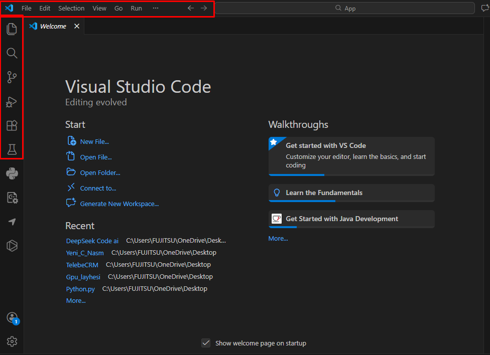

# Proqram Arxitekturası

## 📋 Layihə Planı

### 1. Çəkirdək (Core) - C++
- Proqramın əsas çəkirdək kodu C++ dilində yazılacaq
- Yüksək performans və sistem səviyyəsində idarəetmə
- **Fayllar:** `cpp_files/core.h`, `cpp_files/core.cpp`, `cpp_files/main.cpp`
- **Funksiyalar:**
  - `Application` - Proqramın əsas sinifi (initialize, run, shutdown)
  - `DataManager` - Verilənlər bazası ilə əlaqə
  - `Logger` - Log sistemi

### 2. Dizayn / İstifadəçi İnterfeysi - Go
- Proqramın dizaynı və interfeysi Go dilində hazırlanacaq
- **Fyne** GUI kitabxanası ilə qrafik interfeys
- **Fayl:** `ui.go`
- **Funksiyalar:**
  - `App` - GUI tətbiqi
  - Pəncərə idarəetməsi (800x600)
  - Düymələr: Yeni, Aç, Saxla, Çıxış
  - C++ çəkirdəyi ilə əlaqə (CGO vasitəsilə)

### 3. Verilənlər Bazası - SQL (SQLite)
- Verilənlər bazası üçün SQL skriptləri yazılacaq
- **Fayl:** `schema.sql`
- **Cədvəllər:**
  - `users` - İstifadəçilər
  - `settings` - Parametrlər
  - `sessions` - Sessiyalar
  - `logs` - Loglar

---

## 🏗️ Sistem Strukturu

```
┌─────────────────────────────────────┐
│           Go (Dizayn/UI)            │
│         Fyne GUI Framework          │
├─────────────────────────────────────┤
│          C++ (Çəkirdək)             │
│    Application, DataManager, Log    │
├─────────────────────────────────────┤
│        SQLite (Database)            │
│   users, settings, sessions, logs   │
└─────────────────────────────────────┘
```

---

## 📁 Fayl Strukturu

```
App/
├── app.md              # Layihə planı
├── go.mod              # Go modul faylı
├── ui.go               # Go UI kodu (Fyne)
├── schema.sql          # SQL sxemi
├── cpp_files/
│   ├── CMakeLists.txt  # CMake konfiqurasiyası
│   ├── core.h          # C++ header
│   ├── core.cpp        # C++ implementasiya
│   └── main.cpp        # C++ giriş nöqtəsi
└── image.png           # Arxitektura şəkli
```

---

## 🔧 Quraşdırma və İşə Salma

### C++ Çəkirdəyi (DLL/Shared Library)
```bash
cd cpp_files
mkdir build && cd build
cmake ..
cmake --build .
```

### Go UI Tətbiqi
```bash
go mod tidy
go run ui.go
```

### EXE Faylı Yaratmaq
```bash
go build -o APP.exe ui.go
```

---

## 🔗 C++ və Go Əlaqəsi (DLL)

Go tətbiqi C++ çəkirdəyi ilə **DLL** vasitəsilə əlaqə qurur. Bu, Go və C++ arasında əlaqə qurmağın ən yaxşı yoludur.

---

## 🔧 C++ DLL Kitabxanası

### Header Faylı (`core_dll.h`)

```cpp
#ifndef CORE_DLL_H
#define CORE_DLL_H

// DLL Export/Import makrosu
#ifdef _WIN32
    #ifdef CORE_EXPORTS
        #define CORE_API __declspec(dllexport)
    #else
        #define CORE_API __declspec(dllimport)
    #endif
#else
    #define CORE_API
#endif

#ifdef __cplusplus
extern "C" {
#endif

// Çəkirdək funksiyaları
CORE_API int core_initialize();
CORE_API void core_shutdown();
CORE_API const char* core_get_version();
CORE_API void core_log(const char* level, const char* message);
CORE_API int core_process_data(const char* input, char* output, int output_size);

// Verilənlər bazası funksiyaları
CORE_API int db_connect(const char* path);
CORE_API void db_disconnect();
CORE_API int db_execute(const char* sql);

#ifdef __cplusplus
}
#endif

#endif // CORE_DLL_H
```

---

### İmplementasiya Faylı (`core_dll.cpp`)

```cpp
#include "core_dll.h"
#include <cstring>
#include <cstdio>
#include <string>

// Daxili vəziyyət
static bool g_initialized = false;
static const char* g_version = "1.0.0";

// Çəkirdək funksiyaları
CORE_API int core_initialize() {
    if (g_initialized) return 1;
    
    printf("[C++] Core initializing...\n");
    g_initialized = true;
    printf("[C++] Core initialized successfully\n");
    return 1;
}

CORE_API void core_shutdown() {
    printf("[C++] Core shutting down...\n");
    g_initialized = false;
}

CORE_API const char* core_get_version() {
    return g_version;
}

CORE_API void core_log(const char* level, const char* message) {
    printf("[C++ %s] %s\n", level, message);
}

CORE_API int core_process_data(const char* input, char* output, int output_size) {
    if (!g_initialized) return 0;
    
    std::string result = "Processed: ";
    result += input;
    
    if ((int)result.length() < output_size) {
        strcpy(output, result.c_str());
        return 1;
    }
    return 0;
}

// Verilənlər bazası funksiyaları (sadə implementasiya)
static bool g_db_connected = false;

CORE_API int db_connect(const char* path) {
    printf("[C++] Database connecting to: %s\n", path);
    g_db_connected = true;
    return 1;
}

CORE_API void db_disconnect() {
    printf("[C++] Database disconnected\n");
    g_db_connected = false;
}

CORE_API int db_execute(const char* sql) {
    if (!g_db_connected) return 0;
    printf("[C++] SQL: %s\n", sql);
    return 1;
}
```

---

## 🔧 CMake - DLL Yaratmaq

```cmake
cmake_minimum_required(VERSION 3.10)
project(CoreDLL)

set(CMAKE_CXX_STANDARD 17)

# DLL yaratmaq
add_library(core SHARED
    core_dll.cpp
    core_dll.h
)

# Export makrosunu təyin et
target_compile_definitions(core PRIVATE CORE_EXPORTS)

# Windows-da .dll faylını App qovluğuna kopyala
if(WIN32)
    add_custom_command(TARGET core POST_BUILD
        COMMAND ${CMAKE_COMMAND} -E copy
        $<TARGET_FILE:core>
        ${CMAKE_SOURCE_DIR}/../core.dll
    )
endif()
```

---

## 🔧 Go - DLL İstifadə Etmək

```go
// UI Package - Go Implementation with Fyne GUI
// C++ DLL ilə inteqrasiya

package main

import (
	"fmt"
	"syscall"
	"unsafe"

	"fyne.io/fyne/v2"
	"fyne.io/fyne/v2/app"
	"fyne.io/fyne/v2/container"
	"fyne.io/fyne/v2/dialog"
	"fyne.io/fyne/v2/widget"
)

// DLL yükləmə
var (
	coreDLL         *syscall.DLL
	procInitialize  *syscall.Proc
	procShutdown    *syscall.Proc
	procGetVersion  *syscall.Proc
	procLog         *syscall.Proc
	procProcessData *syscall.Proc
	procDbConnect   *syscall.Proc
	procDbExecute   *syscall.Proc
	dllLoaded       bool
)

// LoadCoreDLL - C++ DLL-ni yükləyir
func LoadCoreDLL() error {
	var err error
	coreDLL, err = syscall.LoadDLL("core.dll")
	if err != nil {
		fmt.Printf("[WARN] DLL yüklənə bilmədi: %v\n", err)
		fmt.Println("[INFO] Go simulyasiyası istifadə ediləcək")
		dllLoaded = false
		return err
	}

	procInitialize, _ = coreDLL.FindProc("core_initialize")
	procShutdown, _ = coreDLL.FindProc("core_shutdown")
	procGetVersion, _ = coreDLL.FindProc("core_get_version")
	procLog, _ = coreDLL.FindProc("core_log")
	procProcessData, _ = coreDLL.FindProc("core_process_data")
	procDbConnect, _ = coreDLL.FindProc("db_connect")
	procDbExecute, _ = coreDLL.FindProc("db_execute")

	dllLoaded = true
	fmt.Println("[INFO] C++ DLL uğurla yükləndi!")
	return nil
}

// CoreInitialize - Çəkirdəyi başlat
func CoreInitialize() bool {
	if dllLoaded && procInitialize != nil {
		ret, _, _ := procInitialize.Call()
		return ret != 0
	}
	fmt.Println("[Go] Core initializing...")
	return true
}

// CoreShutdown - Çəkirdəyi bağla
func CoreShutdown() {
	if dllLoaded && procShutdown != nil {
		procShutdown.Call()
		coreDLL.Release()
		return
	}
	fmt.Println("[Go] Core shutting down...")
}

// CoreGetVersion - Versiya al
func CoreGetVersion() string {
	if dllLoaded && procGetVersion != nil {
		ret, _, _ := procGetVersion.Call()
		if ret != 0 {
			return goString(ret)
		}
	}
	return "1.0.0-Go"
}

// CoreLog - Log yaz
func CoreLog(level, message string) {
	if dllLoaded && procLog != nil {
		levelPtr, _ := syscall.BytePtrFromString(level)
		msgPtr, _ := syscall.BytePtrFromString(message)
		procLog.Call(uintptr(unsafe.Pointer(levelPtr)), uintptr(unsafe.Pointer(msgPtr)))
		return
	}
	fmt.Printf("[Go %s] %s\n", level, message)
}

// CoreProcessData - Veriləni emal et
func CoreProcessData(input string) string {
	if dllLoaded && procProcessData != nil {
		inputPtr, _ := syscall.BytePtrFromString(input)
		output := make([]byte, 256)
		ret, _, _ := procProcessData.Call(
			uintptr(unsafe.Pointer(inputPtr)),
			uintptr(unsafe.Pointer(&output[0])),
			256,
		)
		if ret != 0 {
			return string(output)
		}
	}
	return "Go Processed: " + input
}

// goString - C string-i Go string-ə çevirir
func goString(ptr uintptr) string {
	if ptr == 0 {
		return ""
	}
	var bytes []byte
	for {
		b := *(*byte)(unsafe.Pointer(ptr))
		if b == 0 {
			break
		}
		bytes = append(bytes, b)
		ptr++
	}
	return string(bytes)
}

// App - Əsas tətbiq strukturu
type App struct {
	fyneApp    fyne.App
	mainWindow fyne.Window
	Title      string
	Version    string
	Running    bool
	statusBar  *widget.Label
}

// NewApp - Yeni tətbiq yarat
func NewApp(title string) *App {
	return &App{
		Title:   title,
		Running: false,
	}
}

// Initialize - Tətbiqi hazırla
func (a *App) Initialize() error {
	// DLL-i yükləməyə çalış
	LoadCoreDLL()

	// Çəkirdəyi başlat
	if !CoreInitialize() {
		return fmt.Errorf("çəkirdək başladıla bilmədi")
	}

	// Versiyanı al
	a.Version = CoreGetVersion()
	CoreLog("INFO", "UI initialized")

	// Fyne tətbiqi
	a.fyneApp = app.New()
	a.mainWindow = a.fyneApp.NewWindow("APP")
	a.mainWindow.Resize(fyne.NewSize(800, 600))

	a.Running = true
	return nil
}

// Run - Tətbiqi işə sal
func (a *App) Run() {
	if !a.Running {
		return
	}

	// Başlıq
	titleLabel := widget.NewLabel("🚀 APP Proqramına Xoş Gəlmisiniz!")
	titleLabel.Alignment = fyne.TextAlignCenter
	titleLabel.TextStyle = fyne.TextStyle{Bold: true}

	// DLL statusu
	dllStatus := "❌ Go Simulyasiyası"
	if dllLoaded {
		dllStatus = "✅ C++ DLL Aktiv"
	}
	dllLabel := widget.NewLabel("Çəkirdək: " + dllStatus)
	dllLabel.Alignment = fyne.TextAlignCenter

	// Versiya
	versionLabel := widget.NewLabel("Versiya: " + a.Version)
	versionLabel.Alignment = fyne.TextAlignCenter

	// Status bar
	a.statusBar = widget.NewLabel("✅ Hazır")

	// Düymələr
	btnNew := widget.NewButton("📄 Yeni", func() {
		a.statusBar.SetText("📄 Yeni fayl yaradıldı")
		CoreLog("INFO", "New file created")
		dialog.ShowInformation("Yeni", "Yeni fayl yaradıldı", a.mainWindow)
	})

	btnProcess := widget.NewButton("⚙️ Emal Et", func() {
		result := CoreProcessData("Test Data")
		a.statusBar.SetText("⚙️ " + result)
		dialog.ShowInformation("Nəticə", result, a.mainWindow)
	})

	btnSave := widget.NewButton("💾 Saxla", func() {
		a.statusBar.SetText("💾 Saxlanıldı")
		CoreLog("INFO", "File saved")
	})

	btnExit := widget.NewButton("🚪 Çıxış", func() {
		a.Shutdown()
	})

	buttonBox := container.NewHBox(btnNew, btnProcess, btnSave, btnExit)

	// Konteyner
	content := container.NewVBox(
		widget.NewLabel(""),
		titleLabel,
		dllLabel,
		versionLabel,
		widget.NewLabel(""),
		container.NewCenter(buttonBox),
		widget.NewSeparator(),
		a.statusBar,
	)

	a.mainWindow.SetContent(container.NewCenter(content))
	a.mainWindow.ShowAndRun()
}

// Shutdown - Tətbiqi bağla
func (a *App) Shutdown() {
	a.Running = false
	CoreShutdown()
	if a.fyneApp != nil {
		a.fyneApp.Quit()
	}
}

func main() {
	myApp := NewApp("APP")

	if err := myApp.Initialize(); err != nil {
		fmt.Printf("Xəta: %v\n", err)
		return
	}

	myApp.Run()
}
```

---

## 🚀 DLL İstifadə Qaydası

### 1. C++ DLL-ni yarat:
```powershell
cd cpp_files
mkdir build
cd build
cmake ..
cmake --build . --config Release
```

### 2. Go tətbiqini işə sal:
```powershell
cd c:\Users\FUJITSU\OneDrive\Desktop\App
go run ui.go
```

---

## 📊 Komponent Cədvəli

| Komponent | Fayl | Vəzifə |
|-----------|------|--------|
| **C++ DLL** | `core.dll` | Çəkirdək funksiyaları |
| **Go UI** | `ui.go` | İstifadəçi interfeysi |
| **Əlaqə** | `syscall` | DLL yükləmə və çağırış |

> ⚠️ **Qeyd:** DLL tapılmasa, Go avtomatik öz simulyasiyasını istifadə edəcək! ✅


